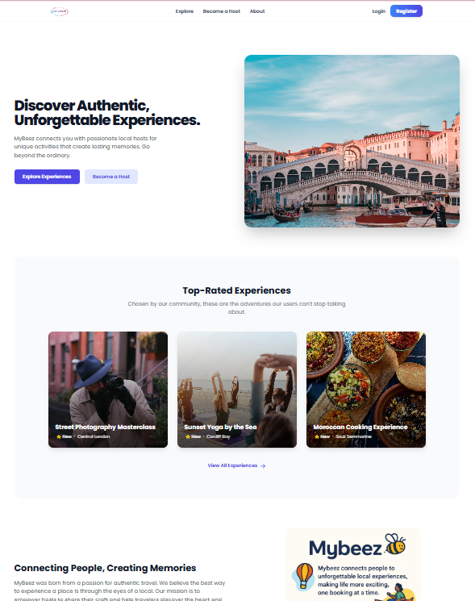
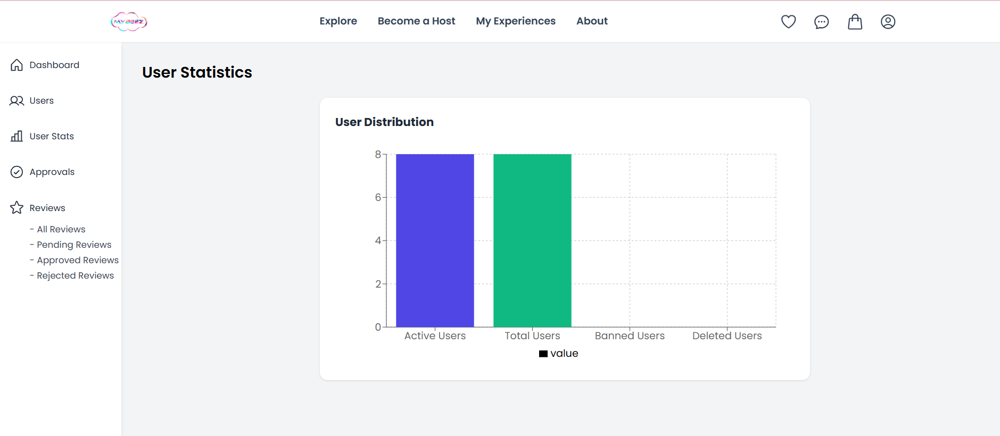
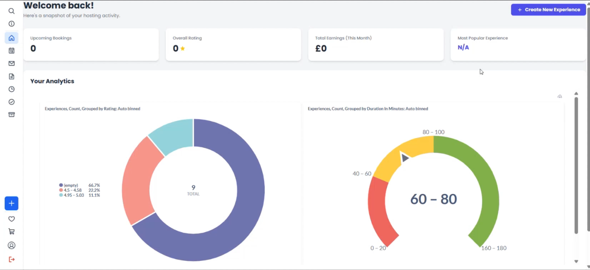

# MyBeez

MyBeez is a digital marketplace designed to connect users with creative local experiences. Inspired by Airbnb Experiences, the platform empowers **hosts** to monetise their skills, **users** to book activities securely, and **admins** to moderate content and ensure community trust.

The project was developed as part of a master’s software engineering team project, transitioning from a prototype into a fully functional MVP with cloud deployment.

---

## ✨ Features

* 🗓️ **Booking Modal** – availability selection, capacity/pricing logic for group/private bookings
* 💳 **Stripe Payment Integration** – secure checkout with Strong Customer Authentication (SCA) support
* 🔒 **JWT Authentication** – stateless, secure login with role-based access (user, host, admin)
* 📬 **Secure Messaging** – encrypted inbox with read/unread tracking, profanity and PII filtering
* 📊 **Host Dashboard** – create/manage experiences, track bookings and earnings
* 🛠️ **Admin Console** – approve/reject experiences, moderate reviews, enforce community standards
* 🌐 **Responsive UI** – accessible, mobile-friendly layouts built with Tailwind CSS

---

## 🛠️ Tech Stack

**Frontend**: React.js + Tailwind CSS
**Backend**: Java Spring Boot (REST APIs, JPA)
**Database**: MariaDB (Cloud SQL on GCP)
**Authentication**: JWT (JSON Web Tokens)
**Deployment**: GitLab CI/CD → Docker → Google Cloud Run
**Payment**: Stripe

---

## 🚀 Getting Started

### Frontend Setup

```bash
git clone https://github.com/Hajaaaaar/MyBeez.git
cd mybeez-frontend
npm install
npm start
```

App runs on [http://localhost:3000](http://localhost:3000).

### Backend Setup

```bash
cd mybeez-backend
./mvnw spring-boot:run
```

Backend runs on [http://localhost:8080](http://localhost:8080).

---

## 📸 Screenshots


### Homepage



### Explore Page


### Experience Detail Page


### Admin Page



### Host Page



---

## 🎥 Demo Video

[


---

## 🔮 Future Work

* Expanded **Stripe integration** (refunds, multi-currency, payouts)
* Automated **accessibility testing** (axe-core, Storybook a11y add-on)
* **AI-assisted moderation** for reviews and experiences
* **Chatbot** for guests, hosts, and admins to reduce support load
* Performance and scalability improvements (caching, monitoring, SLOs)


